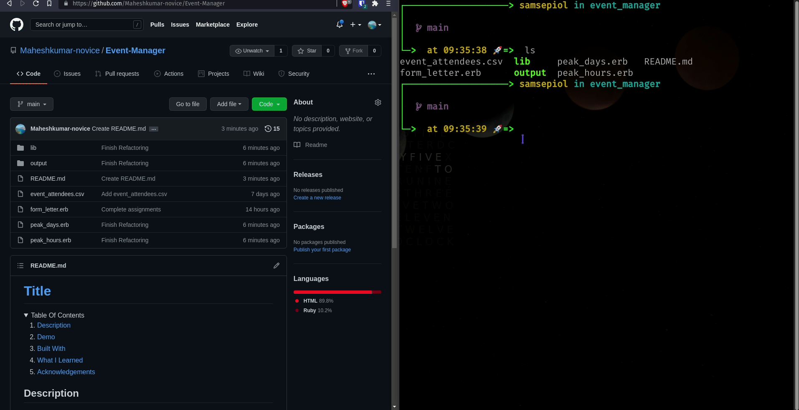

# [Event-Manager](https://www.theodinproject.com/paths/full-stack-ruby-on-rails/courses/ruby-programming/lessons/event-manager-ruby-programming)
This project is part of the [The Odin Project](https://www.theodinproject.com/paths/full-stack-ruby-on-rails/courses/ruby-programming/lessons/event-manager-ruby-programming)'s Ruby curriculum.

  
Table Of Contents

  <ol>
    <li>
      <a href="#description">Description</a>
    </li>
    <li>
      <a href="#demo">Demo</a>
    </li>
    <li>
      <a href="#built-with">Built With</a>
    </li>
     <li>
      <a href="#what-i-learned">What I Learned</a>
    </li>
     <li>
      <a href="#acknowledgements">Acknowledgements</a>
    </li>
  </ol>

## Description
Event Manager Project - Code along & Assignments

## Demo

 
  
## Built With
* Ruby

## What I Learned
* How to work with CSV files and File operations with Ruby
* How to create ERB template with Ruby
* How to use ERB template with Ruby
* How to use Google Civic API with Ruby
* How to organise methods
* How to use Date and Time with Ruby
* How to format Date and Time with Ruby
* How to use begin and rescue in Ruby
* How to create Directories with Ruby
  
## Acknowledgements
* [The Odin Project](https://theodinproject.com)

[Move To Top](#event-manager)
